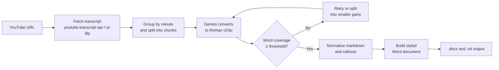

<div align="center">

# Roman Urdu Transcribe

**Turn any YouTube video into professionally formatted Roman Urdu study notes.**

Powered by YouTube transcripts and Google Gemini. Delivered as a styled Word document and plain text.


[Quick Start](#-quick-start) · [Installation](#-installation) · [Usage](#-usage) · [Configuration](#-configuration) · [Troubleshooting](#-troubleshooting)

</div>

---

## Table of Contents

1. [Overview](#-overview)
2. [Key Features](#-key-features)
3. [How It Works](#-how-it-works)
4. [Requirements](#-requirements)
5. [Quick Start](#-quick-start)
6. [Installation](#-installation)
7. [Getting a Gemini API Key](#-getting-a-gemini-api-key)
8. [Usage](#-usage)
9. [Output](#-output)
10. [Configuration](#-configuration)
11. [Project Structure](#-project-structure)
12. [Troubleshooting](#-troubleshooting)
13. [Security Best Practices](#-security-best-practices)
14. [Limitations](#-limitations)
15. [Author](#-author)

---

## Overview

**Roman Urdu Transcribe** takes a YouTube video URL, retrieves its subtitles, and converts the full transcript into **word-for-word Roman Urdu**. The result is organized into a clean, book-style study guide with headings, lists, tables, highlighted callout boxes, and clickable timestamps.

It is designed for students, teachers, and learners who want accurate, readable, and well-structured notes from video lectures and courses without manual typing.

---

## Key Features

| Category | Capability |
| --- | --- |
| **Automation** | One-command launcher (`Run.sh`) handles environment, API key, URL input, and logging |
| **Transcript retrieval** | Uses `youtube-transcript-api` with a `yt-dlp` fallback; supports Urdu, Hindi, and English subtitles |
| **Faithful conversion** | Converts every sentence to Roman Urdu without summarizing, merging, or skipping content |
| **Quality control** | Compares input and output word counts; chunks below the coverage threshold are retried or split automatically |
| **Structured notes** | Headings, bullet and numbered lists, tables, and callouts for **Questions**, **Definitions**, and **Notes** |
| **Smart emphasis** | Auto-bold for numbers, amounts, percentages, and uppercase terms; key lines are highlighted |
| **Clickable timestamps** | Every timestamp in the Word file links to the exact moment in the video |
| **Auto branding** | Header and tagline are generated from the channel name and video subject |
| **Resilience** | Automatic fallback across available Gemini models when one is rate-limited |
| **Auditability** | Every run is saved to the `logs/` folder |

---

## How It Works



---

## Requirements

| Requirement | Details |
| --- | --- |
| **Operating system** | Ubuntu 22.04+ (recommended), Windows 10/11 (WSL2 or native), macOS 12+ |
| **Python** | 3.9 or later |
| **System tools** | `python3`, `python3-venv`, `python3-pip`, `ffmpeg`, `git` |
| **Python packages** | `python-docx`, `google-genai`, `requests`, `youtube-transcript-api`, `yt-dlp` |
| **API access** | A free [Google Gemini API key](https://aistudio.google.com/apikey) |
| **Network** | Internet access to YouTube and the Gemini API |

---

## Quick Start

For **Ubuntu / Linux** users. Run each command one at a time, in order.

**1. Update the package list**

```bash
sudo apt update
```

**2. Install system dependencies**

```bash
sudo apt install -y python3 python3-venv python3-pip ffmpeg git
```

**3. Clone the repository**

```bash
git clone https://github.com/AwaisUmarHayatOfficial/ROMAN-URDU-TRANSCRIBE.git
```

**4. Enter the project folder**

```bash
cd ROMAN-URDU-TRANSCRIBE
```

**5. Create a virtual environment**

```bash
python3 -m venv venv
```

**6. Activate the virtual environment**

```bash
source venv/bin/activate
```

**7. Upgrade pip**

```bash
pip install --upgrade pip
```

**8. Install the Python packages**

```bash
pip install python-docx google-genai requests youtube-transcript-api yt-dlp
```

**9. Make the launcher executable**

```bash
chmod +x Run.sh
```

**10. Run the automated launcher**

```bash
./Run.sh
```

`Run.sh` automates everything from here: it activates the virtual environment, asks for your Gemini API key and the YouTube URL, runs the conversion, and saves the logs. No further manual commands are needed.

Using Windows or macOS? See [Installation](#-installation) below.

---

## Installation

Select your operating system.

<details open>
<summary><b>🐧 Ubuntu / Linux</b></summary>

<br>

**Step 1. Update the package list**

```bash
sudo apt update
```

**Step 2. Install system dependencies**

```bash
sudo apt install -y python3 python3-venv python3-pip ffmpeg git
```

**Step 3. Clone the repository**

```bash
git clone https://github.com/AwaisUmarHayatOfficial/ROMAN-URDU-TRANSCRIBE.git
```

**Step 4. Enter the project folder**

```bash
cd ROMAN-URDU-TRANSCRIBE
```

**Step 5. Create a virtual environment**

```bash
python3 -m venv venv
```

**Step 6. Activate the virtual environment**

```bash
source venv/bin/activate
```

**Step 7. Upgrade pip**

```bash
pip install --upgrade pip
```

**Step 8. Install the Python packages**

```bash
pip install python-docx google-genai requests youtube-transcript-api yt-dlp
```

**Step 9. Make the launcher executable**

```bash
chmod +x Run.sh
```

**Step 10. Run the automated launcher (recommended)**

```bash
./Run.sh
```

The launcher handles the rest automatically. See [Usage](#-usage) for details.

> **Note:** Run these commands as a normal user. Only the `apt` commands require `sudo`. Avoid using a root shell (`sudo su`), which causes the virtual environment and generated files to be owned by root.

</details>

<details>
<summary><b>Windows</b></summary>

<br>

Two options are available. **Option A (WSL2) is recommended**, because `Run.sh` is a Bash script: once the environment is set up, a single `./Run.sh` command automates everything, exactly as it does on Ubuntu.

### Option A: WSL2 with Ubuntu (recommended, uses `./Run.sh`)

**Step 1. Install WSL with Ubuntu** (run in PowerShell as Administrator)

```powershell
wsl --install -d Ubuntu
```

**Step 2.** Restart the computer when prompted, then open **Ubuntu** from the Start menu and create your Linux username and password.

**Step 3.** Inside the Ubuntu terminal, follow the **Ubuntu / Linux** steps above. The last step runs `./Run.sh`, which automates the rest.

> **Tip:** To open the project folder in Windows File Explorer, run the following command from inside the project directory:
>
> ```bash
> explorer.exe .
> ```

### Option B: Native Windows (PowerShell, manual method)

`Run.sh` cannot run in PowerShell, so this option uses manual commands to start the Python script. Choose Option A if you want the automated launcher.

**Step 1. Install Python**

```powershell
winget install -e --id Python.Python.3.12
```

**Step 2. Install FFmpeg**

```powershell
winget install -e --id Gyan.FFmpeg
```

**Step 3. Install Git**

```powershell
winget install -e --id Git.Git
```

Close and reopen PowerShell after these installations.

**Step 4. Clone the repository**

```powershell
git clone https://github.com/AwaisUmarHayatOfficial/ROMAN-URDU-TRANSCRIBE.git
```

**Step 5. Enter the project folder**

```powershell
cd ROMAN-URDU-TRANSCRIBE
```

**Step 6. Delete the bundled Linux virtual environment**

The `venv` folder in the repository was created on Linux and does not work on Windows.

```powershell
Remove-Item -Recurse -Force venv
```

**Step 7. Create a new virtual environment**

```powershell
python -m venv venv
```

**Step 8. Activate the virtual environment**

```powershell
.\venv\Scripts\Activate.ps1
```

If PowerShell blocks the script, run this once and then repeat Step 8:

```powershell
Set-ExecutionPolicy -Scope CurrentUser -ExecutionPolicy RemoteSigned
```

**Step 9. Upgrade pip**

```powershell
python -m pip install --upgrade pip
```

**Step 10. Install the Python packages**

```powershell
pip install python-docx google-genai requests youtube-transcript-api yt-dlp
```

**Step 11. Set your Gemini API key** (applies only to the current PowerShell window)

```powershell
$env:GEMINI_API_KEY = "your_api_key_here"
```

**Step 12. Run the converter**

```powershell
python yt_to_roman_urdu.py "https://www.youtube.com/watch?v=XXXXXXXXXXX"
```

If the script asks for the key, paste it when prompted.

</details>

<details>
<summary><b> macOS</b></summary>

<br>

These steps work on Apple Silicon and Intel Macs. Use the **Terminal** app.

**Step 1. Install Homebrew** (skip if already installed)

```bash
/bin/bash -c "$(curl -fsSL https://raw.githubusercontent.com/Homebrew/install/HEAD/install.sh)"
```

**Step 2. Install Python**

```bash
brew install python
```

**Step 3. Install FFmpeg**

```bash
brew install ffmpeg
```

**Step 4. Install Git**

```bash
brew install git
```

**Step 5. Clone the repository**

```bash
git clone https://github.com/AwaisUmarHayatOfficial/ROMAN-URDU-TRANSCRIBE.git
```

**Step 6. Enter the project folder**

```bash
cd ROMAN-URDU-TRANSCRIBE
```

**Step 7. Delete the bundled Linux virtual environment**

The `venv` folder in the repository was created on Linux and does not work on macOS.

```bash
rm -rf venv
```

**Step 8. Create a new virtual environment**

```bash
python3 -m venv venv
```

**Step 9. Activate the virtual environment**

```bash
source venv/bin/activate
```

**Step 10. Upgrade pip**

```bash
pip install --upgrade pip
```

**Step 11. Install the Python packages**

```bash
pip install python-docx google-genai requests youtube-transcript-api yt-dlp
```

**Step 12. Make the launcher executable**

```bash
chmod +x Run.sh
```

**Step 13. Run the automated launcher (recommended)**

```bash
./Run.sh
```

The launcher asks for your Gemini API key and the YouTube URL, then runs the conversion automatically.

> **Note for macOS:** `Run.sh` was written for GNU/Linux tools (`stat -c`, `setsid`, `xdg-open`). It runs on macOS, but the 24-hour saved-key feature and automatic browser opening may not work, so you may be asked for your API key on every run. If you run into problems, use the manual method below.

**Alternative: manual method (only if you do not want to use `Run.sh`)**

Set your Gemini API key (applies only to the current Terminal session):

```bash
export GEMINI_API_KEY="your_api_key_here"
```

Run the converter:

```bash
python yt_to_roman_urdu.py "https://www.youtube.com/watch?v=XXXXXXXXXXX"
```

If the script asks for the key, paste it when prompted.

</details>

---

##  Getting a Gemini API Key

1. Open [aistudio.google.com/apikey](https://aistudio.google.com/apikey).
2. Sign in with your Google account.
3. Click **Create API key** and select (or create) a Google Cloud project.
4. Copy the key (it usually begins with `AIza...`).

On first launch, `Run.sh` walks you through these steps and can open the page in your browser automatically.

---

## Usage

### Recommended: automated launcher (Ubuntu / Linux, Windows WSL2, macOS)

After the environment is set up, run the launcher from the project folder:

```bash
./Run.sh
```

If you get a "Permission denied" error, make it executable once and run it again:

```bash
chmod +x Run.sh
```

The launcher will:

1. Activate the virtual environment.
2. Ask for your Gemini API key (input is hidden). The key is saved in `Gemini_Keys` and **deleted automatically after 24 hours**.
3. Ask for the YouTube video URL.
4. Convert the transcript and display live progress.
5. Offer to convert another video when finished.

To remove the saved key and enter a different one:

```bash
./Run.sh --reset-key
```

### Alternative: manual method (native Windows, or if you prefer not to use `Run.sh`)

Run the Python script directly with your API key set in the environment:

```bash
python yt_to_roman_urdu.py "https://www.youtube.com/watch?v=XXXXXXXXXXX"
```

---

## Output

For every video, the following files are created in the project folder:

| File | Description |
| --- | --- |
| `<video_title>.docx` | Styled Word document with Roman Urdu notes |
| `<video_title>.txt` | Plain-text version of the notes |
| `logs/run_<timestamp>.log` | Complete log of the run |

**Document highlights**

- Branded header, tagline, and `Page X of Y` footer
- Heading hierarchy with a navy and gold colour theme
- Colour-coded callout boxes: **SAWAL / JAWAB** (questions), **TAREEF / DEFINITION**, and **NOTE**
- Markdown tables for comparisons and lists of values
- Clickable `[MM:SS]` timestamps linked to the source video

---

## Configuration

Design and behaviour settings are located at the top of `yt_to_roman_urdu.py`.

| Setting | Default | Description |
| --- | --- | --- |
| `BRAND_OVERRIDE` | `""` | Force a specific brand name in the header |
| `SUBJECT_OVERRIDE` | `""` | Force a specific subject in the tagline |
| `FOOTER_LABEL` | `"Roman Urdu"` | Text shown in the page footer |
| `FONT_NAME` | `"Roboto Serif"` | Document font |
| `SHOW_TIMESTAMPS` | `True` | Show or hide `[MM:SS]` markers |
| `CHUNK_MINUTES` | `5` | Transcript chunk size sent to Gemini |
| `MIN_COVERAGE` | `0.88` | Minimum word coverage before a chunk is retried |
| `AUTO_BOLD` | `True` | Auto-bold numbers, amounts, percentages, and uppercase terms |
| `ADD_CHUNK_HEADINGS` | `False` | Add a heading for every chunk |

> **Font note:** *Roboto Serif* must be installed on the computer that opens the `.docx`. Download it from [Google Fonts](https://fonts.google.com/specimen/Roboto+Serif), or set `FONT_NAME` to a font you already have, such as `"Georgia"` or `"Cambria"`.

---

## Project Structure

```text
ROMAN-URDU-TRANSCRIBE/
├── Run.sh                 # One-click launcher (Linux / WSL2)
├── yt_to_roman_urdu.py    # Main conversion script
├── Gemini_Keys            # Temporary saved API key (auto-deleted after 24 hours)
├── logs/                  # Run logs
├── venv/                  # Python virtual environment (created during setup)
└── README.md
```

---

## Troubleshooting

| Problem | Solution |
| --- | --- |
| `Virtual environment not found` | Create the environment inside the project folder: `python3 -m venv venv`. |
| `ModuleNotFoundError` | Activate the environment (`source venv/bin/activate`) and re-run the `pip install` command. |
| `python3 -m venv` fails | Install the package: `sudo apt install python3-venv`. |
| Permission denied on `Run.sh` | Run `chmod +x Run.sh`, then start it with `./Run.sh`. |
| API key invalid or expired | Run `./Run.sh --reset-key` and enter a new key. |
| No subtitles found | The video may be a live stream or have captions disabled. Wait until a live stream ends (captions can take hours) or try another video. |
| Rate-limit or quota errors | Wait a few minutes and retry. The tool already retries and falls back across Gemini models. |
| `ffmpeg` or `yt-dlp` not found | Confirm FFmpeg is installed, is in your `PATH`, and that the virtual environment is active. |
| Windows: `python` is not recognized | Reopen PowerShell after installing Python, or reinstall with **Add Python to PATH** selected. |
| Windows: `running scripts is disabled` | Run `Set-ExecutionPolicy -Scope CurrentUser -ExecutionPolicy RemoteSigned`. |
| Windows / macOS: venv activation fails | Delete the bundled Linux `venv` folder and create a new one (see the installation steps). |

---

## Security Best Practices

Create a `.gitignore` file in the project folder so that keys, environments, logs, and generated notes are never pushed to GitHub. Add these lines to it:

```gitignore
venv/
logs/
Gemini_Keys
*.docx
*.txt
```

- **Never commit your API key.**
- If a key was ever committed or shared, revoke it at [aistudio.google.com/apikey](https://aistudio.google.com/apikey) and create a new one.
- Keep your key private and do not paste it in public chats or screenshots.

---

## Limitations

- The video must have captions (manual or auto-generated). Videos without subtitles cannot be converted.
- Output quality depends on the accuracy of the source subtitles and on the Gemini model used.
- Gemini API usage is subject to Google's quotas and rate limits.
- Use of this tool must respect the YouTube Terms of Service and the rights of content creators.

---

## Author

**Awais Umar Hayat**
GitHub: [@AwaisUmarHayatOfficial](https://github.com/AwaisUmarHayatOfficial)

---

<div align="center">

If this project helps you, consider giving it a on GitHub.

</div>
